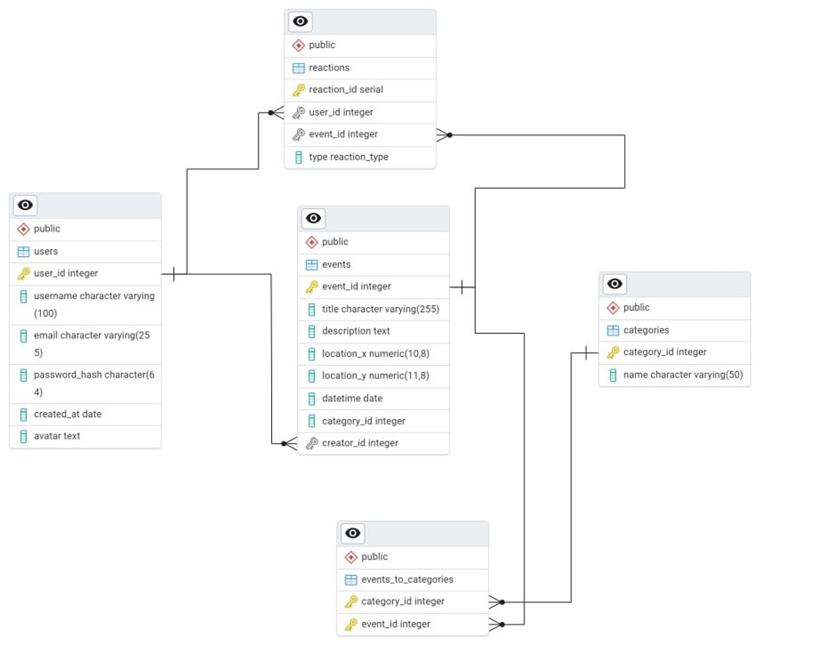

<h1>Описание базы данных нашего веб-приложения</h1> 

База данных разработана для хранения информации о пользователях, их откликов на мероприятия, данных о мероприятиях и их категорях.

<h1> Основные таблицы и их назначения </h1>

**Таблица "Users"**: 
Содержит данные о пользователях. 
Связь с таблицей "Reactions".Пользователь может ставить реакции на мероприятие,также эта свзять необходима для установления свзяи M:M между таблицами "Events" и "Users". 

**Таблица "Categories"**:  
Содержит название категории и ее id, нужна для определения категории мероприятия. 
Связь с таблицей "Events_to_categories": необходима для установления  
Связи M:M между таблицами "Categories" и "Events". 

**Таблица "Events"**: 
Содержит информацию о мероприятиях. 
Связь с таблицей "Reactions", "Events_to_categories" :связь с первой таблицей необходима для установления связи M:M между таблицами " Users " и "Events", со второй для установления связи M:M между таблицами " Categories " и "Events" 

**Таблица Reactions**: 
Фиксирует реакции пользователей на мероприятия. 
Связь с таблицами "Events" и "Users":необходима для установления свзяи M:M между таблицами "Events" и "Users". 

<h1>Физическая схема базы данных</h1>

